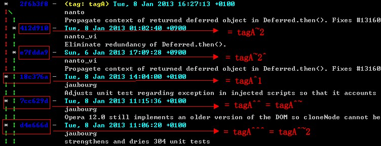
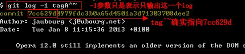
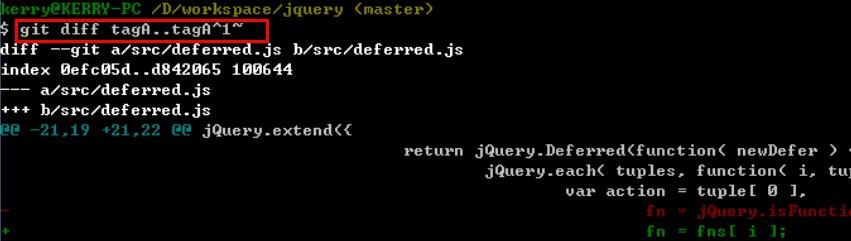

# git系列(1) - 从git中的引用开始说起

git的基本使用，网上已有很多资源，本系列不再赘述。
本系列文章总结了一些使用git的过程中积累的经验，分享给各位geek们~

## git中的引用

你可以把git想象成一个键值结构的数据存储池，你向其中插入数据，它给你返回一个key，让你能够使用这个key再次获取你插入的数据。这个key就是每个commit中都有的SHA-1值。

git中的分支名、远程分支名、tag等都是指向某个commit的引用。比如 `master` 分支, `origin/master` 远程分支, `v1.2` tag等都是引用，它们通过保存某个commit的SHA-1值，从而指向某个commit。 
而分支名指向的commit，就是这个分支上最新的commit（如果你没有修改历史commit记录的话，后续文章介绍怎么修改）。
而 `HEAD` 也是一个引用，一般情况下间接指向你当前所在的分支的最新的commit上。不过 `HEAD` 跟git中一般的引用不同，它并不包含某个commit的SHA-1值，而是包含当前所在的分支，所以 `HEAD` 直接指向当前所在的分支，然后间接指向当前所在分支的最新提交。比如你当前在master分支，那么HEAD就指向master，而master又指向master分支中的最新commit，所以HEAD就间接指向那个commit。要证明这一点，打开项目根目录下的 `.git/HEAD` 文件，文件内容为 `ref: refs/heads/master` ，其中 `refs/heads/master` 便是master分支的全称（master只是缩写，当一个分支和一个tag同名的时候，就可以用全称来区分，因为tag名的全称的模式为 `refs/tags/<tagName>` ），顺着 `.git/HEAD` 文件中拿到的引用，打开 `.git/refs/heads/master/` 文件，其中的内容就是master分支上最新commit的SHA-1值。

git用commit对象表示提交，一个commit对象相当于svn中的一个revision，commit对象中的 `parent` 字段也是一个引用，包含着前一个commit对象的SHA-1值，就像单向链表一样。每个commit对象，可以被其子commit、分支、远程分支、tag引用着，不被引用的commit对象视为被删除。所以，要删除分支中的一个commit对象，只要让分支不再直接或间接引用这个commit对象即可，比如，如果这个commit对象是最新的，那么直接让分支名指向前一个commit对象即可，如果不是最新的，让后一个commit对象的parent字段指向前一个commit即可（具体实现在后续文章中介绍）。本系列文章中，commit作名词使用时，就表示commit对象。

## 使用后缀快速指定历史commit记录中的某个commit

使用这些引用，可以指定历史commit记录中的某个commit，然后对其进行某些操作。但是，如果一个commit没有任何引用指向它，怎么指定呢？你可以直接提供其SHA-1值，不过这种无规律的16进制字符串实在难记，不方便，比如我只是想看HEAD的父commit和HEAD有什么区别，都需要先找到前一个commit的SHA-1值，太麻烦了，这时候就是后缀 `~n` 和 `^n` 出场的时候了。

`<commit>~n` 这个模式表示一个commit的第几级祖先commit。比如 `<commit>~1` 表示其父级commit，`<commit>~2` 表示其祖父级commit。但是，如果一个commit有多个父级commit，比如下图中合并分支时所产生的commit 2f6b3f8就有两个父级commit 18c376a和412d910，这时候git怎么知道你要选取的是哪个父级commit呢？

于是就要用到 `<commit>^n` 这个模式，它表示一个commit的第n个父级commit。比如在下图中，`tagA^1` 表示commit 18c376a， `tagA^2` 就表示commit 412d910。不管数字n有多大，都只是父级，不会到祖父级。如果n大于父级commit的个数，就会报错。

这两个模式中，如果n为0，就表示自己；如果省略n，就表示n为1。
这两个后缀都可以串联起来连续使用，比如这样 `<commit>^n~n^n` ，每一个后缀所做的相对移动，都是基于前面得到的那个commit。

能快速指定历史commit记录中的某个commit后，有什么实际用途呢？常用的一个就是指定两个commit，比较它们之间做了哪些修改了。

## 爸爸，你的提交改了哪里呀

`git diff <commit>..<commit> [--] [<path>]` 这个命令模式可以比较 `..` 后面的 `<commit>` 相对于前面的 `<commit>` 的不同。如果命令中少了任何一个 `<commit>` ，git会用 `HEAD` 补上。 `[<path>]` 是可选的路径名，指定后就只比较符合这个路径的文件。而 `[--]` 也是可选的，用于防止路径名和commit的引用具有相同的名字时引起歧义，跟在 `--` 后面的是路径名。`[--]` 也可用于别的命令中指定路径，避免同名引起歧义。

如果在终端窗口中一页显示不完，按f/b可以forward/back翻页。
如果想看看当前工作目录中做了哪些修改，这是一个常见的需求，直接 `git diff [<path>]` 就可以了。
如果想看通过 `git add` 命令放到暂存区的修改有哪些，加上 `--cached` 参数即可，比如这样 `git diff --cached [<path>]` 。
