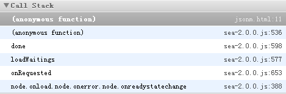

# 探索JSONM的原理

## JSONM简介

JSONM是玉伯在 [《聊聊 JSONP 的 P》](https://github.com/lifesinger/lifesinger.github.com/issues/118) 一文中介绍的一种方案，它可以一定程度上解决JSONP回调函数命名冲突的问题。

对于SeaJS，这个方案的使用方式简单来说就是，像通常加载一个匿名模块那样写，但是指定的URI是JSONP要请求的URI，而回调函数内执行的逻辑是JSONP回调函数内执行的逻辑。

比如SeaJS中：

```JavaScript
seajs.use("http://cross.origin.com/somedata?type=jsonp",
  function dataHandler(data) { // function name will be used in description below
    console.log(data.hello); // => world
  });
```

向一个跨域的支持JSONP的URI发送请求，返回如下：

```JavaScript
define({"hello": "world"});
```

JSONM在各个请求中都使用同一个JSONP回调函数名，从而在一定程度上解决命名冲突的问题，这也是它最神奇的地方。

具体用法请看玉伯的那篇文章。如果没看过，建议先看，再看本文。

## JSONM原理探索

在看玉伯的那篇文章的时候，我就一直好奇：既然各个请求都使用同一个回调函数名，那么是如何把某一次调用跟特定的请求关联在一起的？也就是传给 `define` 的JSON数据是如何传给 `dataHeadler` 回调函数的？

因为不知道别的XMD loader是否实现JSONM，本文中只拿[SeaJS](https://github.com/seajs/seajs)举例，通过分析[SeaJS2.0.0的源码](https://github.com/seajs/seajs/blob/2.0.0/dist/sea-debug.js)探索JSONM的原理。

首先来一窥SeaJS中用作JSONM回调函数的 `define` 函数内部：

```JavaScript
function define(id, deps, factory) {
  // define(factory)
  if (arguments.length === 1) {
    factory = id
    id = undefined
  }

  // Parse dependencies according to the module factory code
  if (!isArray(deps) && isFunction(factory)) {
    deps = parseDependencies(factory.toString())
  }

  var data = { id: id, uri: resolve(id), deps: deps, factory: factory }

  // Try to derive uri in IE6-9 for anonymous modules
  if (!data.uri && doc.attachEvent) {
    var script = getCurrentScript()

    if (script) {
      data.uri = script.src
    }
    else {
      log("Failed to derive: " + factory)

      // NOTE: If the id-deriving methods above is failed, then falls back
      // to use onload event to get the uri
    }
  }

  // Emit `define` event, used in plugin-nocache, seajs node version etc
  emit("define", data)

  data.uri ? save(data.uri, data) :
      // Save information for "saving" work in the script onload event
      anonymousModuleData = data
}
```

显然我们应该关注的是 `arguments.length` 为1的情况，此时传给 `define` 函数的JSON数据的引用保存在 `factory` 形参中。然后运行到 `getCurrentScript()` ，进入这个函数体中。

```JavaScript
function getCurrentScript() {
  if (currentlyAddingScript) {
    return currentlyAddingScript
  }

  // For IE6-9 browsers, the script onload event may not fire right
  // after the the script is evaluated. Kris Zyp found that it
  // could query the script nodes and the one that is in "interactive"
  // mode indicates the current script
  // ref: http://goo.gl/JHfFW
  if (interactiveScript && interactiveScript.readyState === "interactive") {
    return interactiveScript
  }

  var scripts = head.getElementsByTagName("script")

  for (var i = scripts.length - 1; i >= 0; i--) {
    var script = scripts[i]
    if (script.readyState === "interactive") {
      interactiveScript = script
      return interactiveScript
    }
  }
}
```

比想象中要快，到这一步便真像大白了： **原来是通过判断 `script` 标签的 `readyState` 属性是否为 `interactive` 来得知是哪个 `script` 标签中的脚本正在执行，进而得知 `define` 函数是在哪个 `script` 标签中被调用的，然后得知 `script` 标签的URI，也就得知JSONP请求的URI了** 。然后就可以通过这个URI，找到要使用JSON数据的回调函数 `dataHandler`（因为URI和 `dataHandler` 被一起传给了 `seajs.use` 函数，它们的关联可以建立起来）。

---

## 路边的风景：所谓的“同步”加载

SeaJS率先实现在模块的业务逻辑代码内（也就是作为第三个参数传给 `define` 的那个回调函数内。说其是模块的业务逻辑代码，是相对于SeaJS内部的代码）通过 `require` 函数进行“同步”加载依赖。

我们知道XHR对象是可以同步的进行网络I/O的：`oepn` 方法的第三个参数为 `false`，然后在调用 `send` 方法的时候，会阻塞JavaScript的执行和浏览器的UI渲染（两者都在同一个线程），直到响应完全接收。

第一次看到SeaJS的“同步”加载的时候，惊呼awesome！以为就像XHR对象进行同步的网络I/O那样：这些依赖是在执行到 `require` 函数的调用才同步加载的，也就是说 `require` 是阻塞式的，它直到加载完依赖并解析完，得到了依赖的 `exports` 才返回。

但是，在探索JSONM原理的路上，我们可以在路边发现一些有意思的东西。

`define` 函数内通过调用 `parseDependencies` 函数来获取依赖，给 `parseDependencies` 传入的是 `factory.toString()` 。

`Function.prototype.toString` 方法返回函数的字符串表示，包括 `function` 关键字、参数列表、完整的函数体等，这一字符串是有效的JavaScript代码，可以被 `eval` 函数执行。

`factory` 在这里是定义一个模块时，模块依赖加载完毕所执行的回调函数。那么，这里解析的依赖应该就是在回调函数内部“同步”加载的依赖。那么它是如何获取依赖的呢？

在 `parseDependencies` 函数内部：

```JavaScript
var REQUIRE_RE = /"(?:\\"|[^"])*"|'(?:\\'|[^'])*'|\/\*[\S\s]*?\*\/|\/(?:\\\/|[^/\r\n])+\/(?=[^\/])|\/\/.*|\.\s*require|(?:^|[^$])\brequire\s*\(\s*(["'])(.+?)\1\s*\)/g
var SLASH_RE = /\\\\/g

function parseDependencies(code) {
  var ret = []

  code.replace(SLASH_RE, "")
      .replace(REQUIRE_RE, function(m, m1, m2) {
        if (m2) {
          ret.push(m2)
        }
      })

  return ret
}
```

原来如此，通过正则表达式获取传给 `require` 函数的参数，进而得知依赖的是哪些模块。

在 `define` 函数内， `parseDependencies` 函数的返回值直接赋给了 `deps` ，在对 `deps` 的使用上，跟传给 `define` 函数的第二个参数（也就是预先声明的依赖）的使用没有区别。

这说明，一个模块的依赖，无论是通过 `define` 函数的第二个参数预先声明，还是在模块的业务逻辑代码内通过 `require` 函数来获取，都是在执行模块的业务逻辑回调函数之前，就加载依赖。

## Update:

区别是：预先声明的依赖，会先执行依赖模块的业务逻辑回调函数，获取其 `exports` ，再执行本模块的业务逻辑回调函数； 而 **在调用 `require` 函数的时候，不进行网络I/O，更不会产生同步的阻塞，但依赖模块的业务逻辑回调函数是在此时才执行** ，然后获取依赖的 `exports` ，这也就体现了SeaJS的as lazy as possible理念。

简要来说的话，SeaJS的“同步”并不是真正的阻塞式的同步，更多的是一种延迟吧。:smile:

---

## Update 2:

既然在评论中提到了非IE下的方案，这里就加上这部分内容吧。（什么？微机原理半期考试？信~~号~~不~~好~~，听~~不~~见~~~~）

如 `getCurrentScript` 中的注释以及注释中引用的帖子所说， `readyState` 为 `interactive` 的方案只适用于IE。帖子的部分内容如下：

> In non-IE browsers, the onload event is sufficient, it always fires immediately after the script is executed.

那么在非IE下的解决方案基于 `script` 标签的 `onload` 事件，这个事件会在标签内的脚本执行完之后立刻触发。

那么具体是怎么实现的呢？让我们跑个[demo](https://github.com/kerryChen95/Labs/blob/master/host-server/public/201304/JSONM.html)来看看SeaJS内部的实现方式。（如果有兴趣自己运行此demo，可以将它所在的Repository下载到本地，其中有两个[Node](http://nodejs.org/)服务器，一个是宿主服务器，一个是跨域的目标服务器。两个服务器都要先用npm安装好依赖的包后，再用node跑起服务器进程，然后访问 http://localhost:3000/201304/jsonm.html 即可运行此demo）

### 1. 首先看 `seajs.use` 内部做了什么。

具体怎么一步步的步入就不细说了，直接看调用栈的图，感兴趣可以自己按照这个调用栈来步入：


稍微解释一下，图中左列是函数名，右列是函数所在的文件，右列最右边的数字表示执行到文件中的第几行时进行调用和压栈。

我们在jsonm.html文件的第10行调用 `seajs.use` 函数（也就是栈底的anonymous function），开始压栈，一直压栈到 [sea-2.0.0.js](https://github.com/kerryChen95/Labs/blob/master/host-server/public/util/sea-2.0.0.js) 文件中的 `addOnload` 函数，此时控制流停在sea-2.0.0.js文件的374行， `addOnload` 函数如下：

```JavaScript
function addOnload(node, callback, isCSS) {
  var missingOnload = isCSS && (isOldWebKit || !("onload" in node))

  // for Old WebKit and Old Firefox
  if (missingOnload) {
    setTimeout(function() {
      pollCss(node, callback)
    }, 1) // Begin after node insertion
    return
  }

  node.onload = node.onerror = node.onreadystatechange = function() {
    if (READY_STATE_RE.test(node.readyState)) {

      // Ensure only run once and handle memory leak in IE
      node.onload = node.onerror = node.onreadystatechange = null

      // Remove the script to reduce memory leak
      if (!isCSS && !configData.debug) {
        head.removeChild(node)
      }

      // Dereference the node
      node = undefined

      callback()
    }
  }
}
```

374行就是 `node.onload = node.onerror = node.onreadystatechange = function() {` 这行。 `node` 引用调用栈中的 `request` 函数内创建的 `script` 标签，这个标签就是用来发送JSONP请求的。有兴趣的话，可以看到 `request` 函数如下（关注到调用 `addOnload` 那一行即可）：

```JavaScript
function request(url, callback, charset) {
  var isCSS = IS_CSS_RE.test(url)
  var node = doc.createElement(isCSS ? "link" : "script")

  if (charset) {
    var cs = isFunction(charset) ? charset(url) : charset
    if (cs) {
      node.charset = cs
    }
  }

  addOnload(node, callback, isCSS)
```

至此，我们看到SeaJS在发送JSONP请求的 `script` 标签上监听其 `load` , `error` 和 `readystatechange` 事件。在非IE并且请求成功的前提下，本文的分析只关注 `load` 事件。

### 2. 然后看JSONP的返回中调用 `define` 时做了什么

返回如下：

```JavaScript
define({"jsonm":"awesome!"})
```

`define` 函数内部如下：

```JavaScript
function define(id, deps, factory) {
  // define(factory)
  if (arguments.length === 1) {
    factory = id
    id = undefined
  }

  // Parse dependencies according to the module factory code
  if (!isArray(deps) && isFunction(factory)) {
    deps = parseDependencies(factory.toString())
  }

  var data = { id: id, uri: resolve(id), deps: deps, factory: factory }

  // Try to derive uri in IE6-9 for anonymous modules
  if (!data.uri && doc.attachEvent) {
    var script = getCurrentScript()

    if (script) {
      data.uri = script.src
    }
    else {
      log("Failed to derive: " + factory)

      // NOTE: If the id-deriving methods above is failed, then falls back
      // to use onload event to get the uri
    }
  }

  // Emit `define` event, used in plugin-nocache, seajs node version etc
  emit("define", data)

  data.uri ? save(data.uri, data) :
      // Save information for "saving" work in the script onload event
      anonymousModuleData = data
}
```

注意环境是非IE。在 `define` 内，最后给 `anonymousModuleData` 赋值，它是作用域链上的一个变量，赋值后它指向的对象可以如下表示：

```JavaScript
{
  deps: undefined,
  factory: {
    jsonm: "awesome!"
  },
  id: undefined,
  uri: ""
}
```

到此，我们看到传给 `define` 的JSON数据保存在 `anoymousModuleData.factory` 中。

### 3. 最后看 `script` 标签的 `load` 事件回调函数

如前所述，`script` 标签内的脚本执行完，会触发标签的 `load` 事件，进入之前绑定的事件回调函数。然后一步步的步入，直到进入在jsonm.html中传给 `seajs.use` 的回调函数中。调用栈如下：



至于怎么获取返回的JSON数据：

先在调用栈的 `onRequested` 函数中，访问了 `anonymousModuleData` ，将其中的JSON数据保存到SeaJS缓存的modules哈希表当中。

然后在调用栈从上往下数第二个 `anonymouse function` 中，从缓存的modules哈希表中通过URI获取这个module，进而获取其 `exports` 。在SeaJS中，对于只传了一个JSON数据给 `define` 的module，其 `exports` 就是该JSON数据。

到此，就完成了非IE下使用 `onload` 事件的解决方案。

---

### 路边的风景2：清除引用减少内存泄漏

在 `load` 事件的回调函数中，我们看到如下清除引用来减少内存泄漏：

```JavaScript
node.onload = node.onerror = node.onreadystatechange = function() {
  if (READY_STATE_RE.test(node.readyState)) {

    // Ensure only run once and handle memory leak in IE
    node.onload = node.onerror = node.onreadystatechange = null

    // Remove the script to reduce memory leak
    if (!isCSS && !configData.debug) {
      head.removeChild(node)
    }

    // Dereference the node
    node = undefined

    callback()
  }
}
```

总结之，对于绑定有事件回调函数的DOM元素，在清除它的时候需要清除的东西至少有如下：

- 清除在元素上的事件回调函数的引用（如果该事件回调函数还被别的变量或对象属性引用，也要清除该变量或对象属性）
- 把元素从DOM中清除
- 清除引用该元素的变量或对象属性
